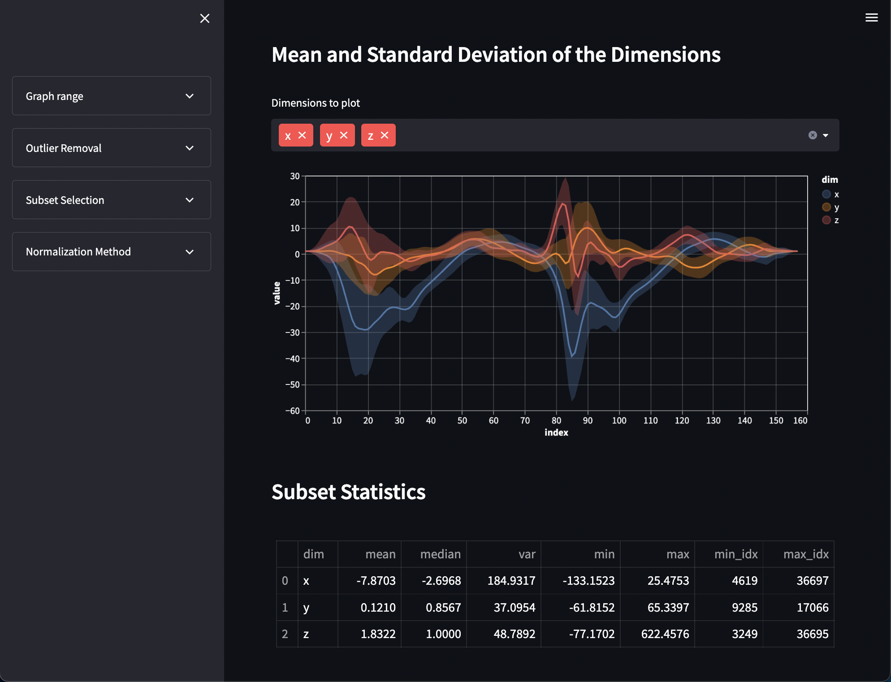

# dataset_vis_1d
A streamlit application that allows to inspect time series / 1d datasets.

It contains (among others) the following functionalities:
- Plot the **mean** and **standard deviation** of dimensions
- Select **subsets** of the data with corresponding labels
- Calculate **statistics** on the data (mean, median, variance, max, min)
- Select different **normalization methods** and see how they affect the data
- **Plot** individual samples

